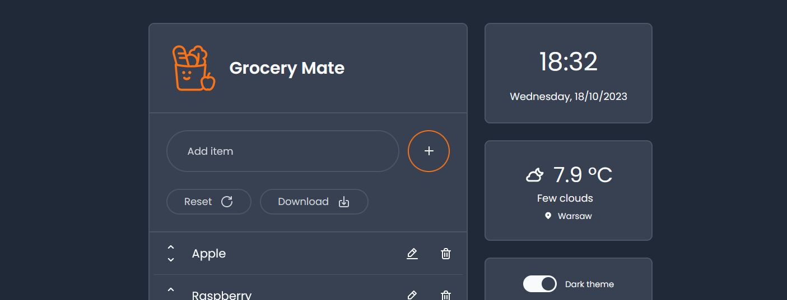
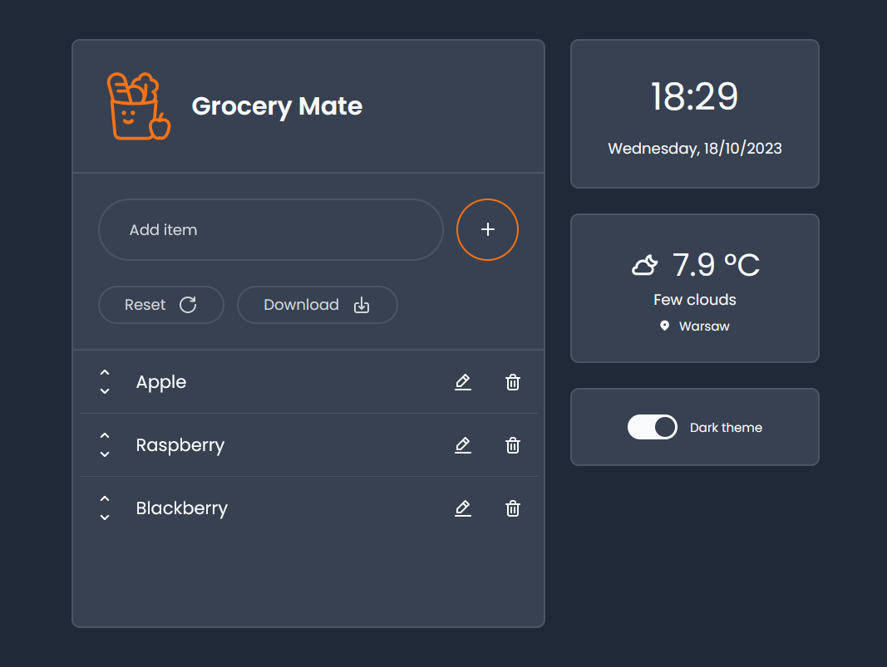
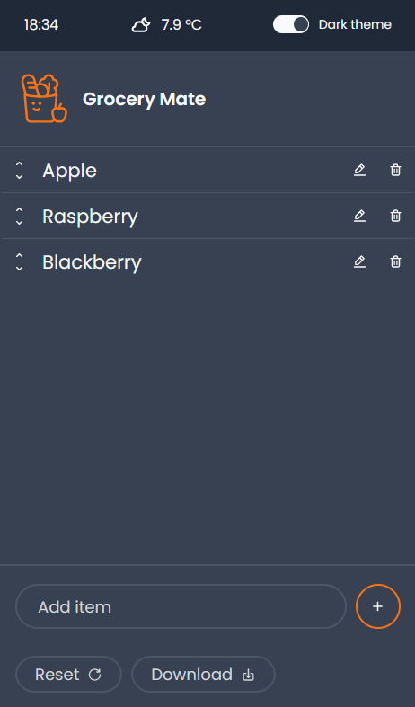
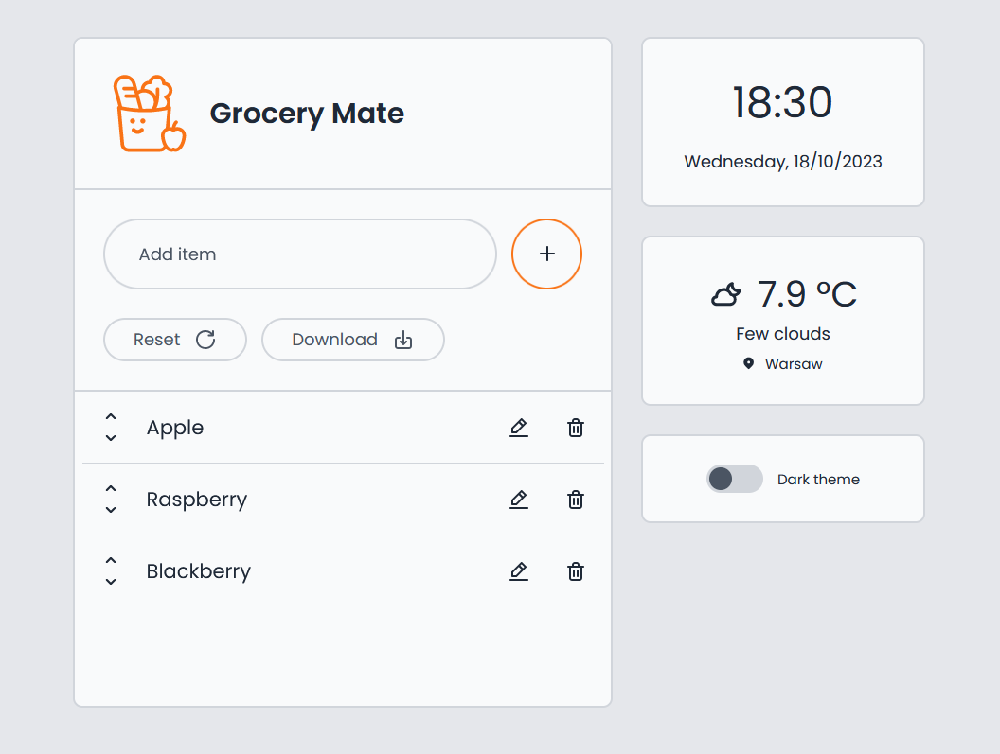

# Grocery Mate - Your shopping assistant

A CRUD application for creating a shopping list, with some additional features.
[See the app live.](https://grocery-mate.netlify.app/)

## Table of Contents

- [General info](#general-info)
- [Setup](#setup)
- [Features](#features)
- [Design](#design)
- [Technologies](#technologies)
- [Testing](#testing)
- [Acknowledgements](#acknowledgements)
- [Contact](#contact)

## General Info

The main purpose of the Grocery Mate application is to help to organize shopping by creating an editable and downloadable list. It comes with the additional feature of displaying current time and weather based on device location. I took on this project to practice developing a more complex no-framework JavaScript app, with elements such as custom state management, DOM updating algorithm, or fetching data from a third party provider. It was also an opportunity to learn how to create unit, integration and functional tests.

## Setup

The project uses [Node](https://nodejs.org/en/) and [NPM](https://www.npmjs.com/). To run the app on your machine you should install all dependencies. Then create a developer build on a localhost port and run your web explorer.

Clone repository

```
git clone https://github.com/M-Mikos/grocery-mate.git
```

Install dependencies

```
npm i
```

Go live with developer build

```
npm run start
```

Grocery Mate is ready at port 8080.

```
http://localhost:8080/
```

If you want to run build process for production (with prefixed and minified CSS), you can use following script:

```
$ npm run build:css
```

## Features

- adding new item to the list, with basic validation
- deleting selected item,
- editing selected item's name,
- changing item position on list by moving it up or down,
- resetting list,
- downloading list as `.txt` file,
- displaying current time and date,
- requesting current weather based on device location,
- switching between light or dark theme,
- auto-saving list data in browser's local storage,
- loading list data from local storage on page load,
- responsive design.

## Design

The Grocery Mate application has been designed in a simple, flat graphic style, enabling easy use of the implemented functionalities. The layout is divided into a main container with an editable list and a sidebar for widgets.

### Responsive web design solutions

In order to ensure optimal presentation of content, two different layouts have been designed for the application. The dimensioning of elements is based on REM units, defined separately for four breaking points (< 600px, < 900px, < 1200px and > 1200px, respectively).

| Desktop layout                                                           | Mobile layout                                                        |
| ----------------------------------------------------------------------- | --------------------------------------------------------------------- |
|  |  |

### Theming

The application can be presented in two different color themes: light and dark. The implementation of color themes is based on CSS variables, making it easy to add new themes.

The structure of the color palette was developed based on the guidelines of the [M2 Google Material Design](https://m2.material.io/design/color/the-color-system.html#color-theme-creation) guide. The source code defines the set of variables responsible for the following application colors:

- primary
- primary variant
- neutral (higher contrast with surface)
- neutral (lower contrast with surface)
- content on primary
- content on surface
- disabled content
- surface
- background
- error

| Light theme                                                               | Dark theme                                                              |
| ------------------------------------------------------------------------- | ----------------------------------------------------------------------- |
|  |  |

### Graphic elements

The Grocery Mate logo is self-prepared. Project includes icons from [Unicons](https://github.com/Iconscout/unicons) set designed by [IconScout](https://iconscout.com).

## Technologies

Application uses modern JavaScript language without using external libraries or frameworks. Code reusability, readability and DRY principles were taken into account. Additionally, the project used a CSS preprocessor and a set of testing tools.

The technologies used and selected technical issues of the Grocery Mate are listed below:

- HTML5,
- JavaScript (ECMAScript 2022),
- [SASS](https://sass-lang.com/),
- [PostCSS](https://postcss.org/) - for autoprefixing,
- [Jest](https://jestjs.io/) - for unit and integration tests,
  - [Jest Environment JSDOM](https://www.npmjs.com/package/jest-environment-jsdom) - for setting up the test environment,
- [Puppeteer](https://jestjs.io/) - for functional (E2E) tests,
- [Live server](https://www.npmjs.com/package/live-server) - for managing live app preview in developer build,
- [Babel](https://www.npmjs.com/package/live-server) - with Jest preset, for managing ES6 modules in test files
- [NPM Run All](https://www.npmjs.com/package/npm-run-all) - for building build scripts

### MVC architecture

The application architecture is based on the MVC structure, with a `model.js` file containing a model class with a state array, application logic and model methods, a set of view files handling the display and behavior of the user interface, and a `controller.js` file. The controller file registers interface event callbacks and calls the corresponding methods for model and interface update.

By implementing the MVC architecture, I had the opportunity to learn more about OOP elements such as encapsulation, inheritance and abstraction.

### Updating algorithm

In order to optimize performance and prevent content flashing, the application utilizes an updating algorithm that handles adding, deleting and editing list items. The algorithm compares the old list DOM tree with the new, virtual DOM (based on updated model data), and changes only the nodes that they differ, instead of re-generating the entire list.

Update function:

```javascript
updateItemList = function (data) {
  const currentDOM = this._parentElement.querySelectorAll("li");

  const curElements = Array.from(currentDOM); // Current DOM nodes
  const newElements = this._generateListElementsArray(data); // Getting virtual DOM tree based on new model data

  // If added
  if (newElements.length > curElements.length)
    // Calling add item method
    this._addItem(newElements.at(-1));

  // If deleted
  if (newElements.length < curElements.length)
    // Calling delete item method
    this._deleteItem(curElements, newElements);

  // If edited
  if (newElements.length === curElements.length)
    // Calling update item method
    this._editItem(curElements, newElements);
};
```

### Saving in local storage

Each time the model is calling a function on the state array, the state array is saved in the local storage of the user's browser. For this purpose, a proxy object has been set for the state array. Proxy intercepts every action performed on the array and, after execution, additionally calls the saving function in local storage.

Function for proxy setting:

```javascript
_setStateProxy = function () {
  const saveList = this._saveList.bind(this);
  const handler = {
    set: function () {
      Reflect.set(...arguments);
      saveList();
      return true;
    },
  };
  this.stateProxy = new Proxy(this.state, handler);
};
```

### Fetching weather data

Weather data is obtained from [OpenWeather API](https://api.openweathermap.org). After the user request, the app communicates with the user's browser's geolocation API and attempts to download data from an external database. The weather data downloader handles timeout and connection errors. Errors related to the browser's geolocation API are also supported (access denial error and unavailable location error).

Modern ES6 solutions, such as `async` function declaration or `Promise.race` method, were used to support asynchronous code responsible for communication with external APIs.

### Event delegation in user interface

In order to handle specific list item buttons events, the event delegation process was utilized. Event for deleting, moving and editing bubbles up, and is being captured at the list container element.

### SASS 7 in 1 structure

CSS style files have been organized according to the 7 in 1 pattern. The following directories were used:

- abstract - files with declarations of functions, mixins and variables.
- base - css cleaning, animations, typography and utility classes
- components - for example `_button.scss` or `_switch.scss`
- layout - widgets styles, list styles etc.
- pages - main app layout style
- themes - separate theme files with color scss variables, which are converted to css variables for easy theme switching

The application does not contain a vendor directory because no styles related to external services have been used.

All files are imported into the main style file `main.scss`, which is compiled to css during the build process.

## Testing

The application comes with a test layer. Full set of unit and integration tests has been prepared for the model object (in the `model.test.js` file), and a layer of sample functional tests for the entire application (in the `controller.test.js` file).

To run all tests suites first create dev build (for E2E tests)

```
npm run start
```

then open new terminal and use following script

```
npm test
```

### Unit and integration tests

Tests were prepared with the Jest library. To test the model, an environment containing mocked local storage, a geolocation API getCurrentPosition method and a fetch function for simulating data obtained from an external source was used.

To run unit and integration tests use following script

```
npm test model
```

### Functional (E2E) tests

A layer of E2E tests was prepared for the application, covering the shopping list functionalities. Functional tests were performed using the Puppeteer library, controlling the test version of the Chrome browser. In order to properly perform the tests, the application must be present on port 8080, therefore a dev build must be created.

To run functional tests first create dev build

```
npm run start
```

then open new terminal and use following script

```
npm test controller
```

If you want to see functional test in action, you can uncomment lines in browser launching options object

```javascript
beforeAll(async () => {
  browser = await puppeteer.launch({
    // Uncomment three following lines for live test preview
    // headless: false,
    // slowMo: 50,
    // args: ["--window-size=1920,1080"],
  });
});
```

## Acknowledgements

Useful resources

- _The Complete JavaScript Course 2023: From Zero to Expert!_ - by Jonas Schmedtmann
- _Build Responsive Real-World Websites with HTML and CSS_ - by Jonas Schmedtmann

Weather Data

- [OpenWeather API](https://api.openweathermap.org)

Assets

- [Unicons](https://github.com/Iconscout/unicons) designed by [IconScout](https://iconscout.com).

## Contact

Design & code by [Marcin Mikos](mailto:mikos.marcin.m@gmail.com) - feel free to contact me!
